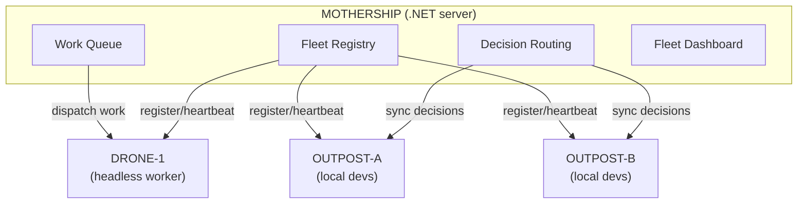
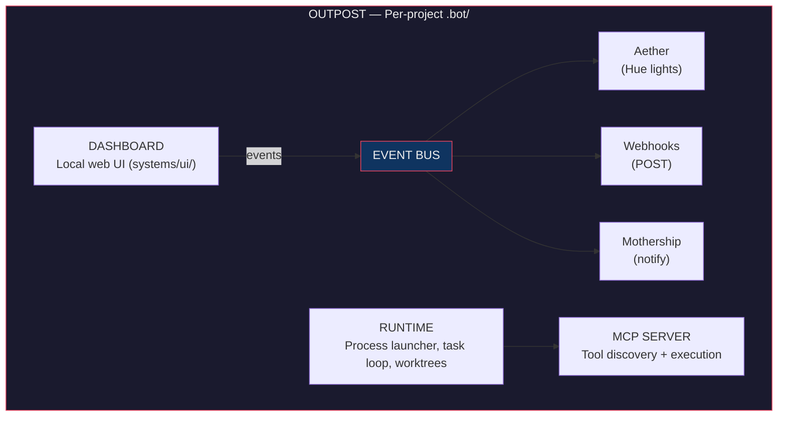
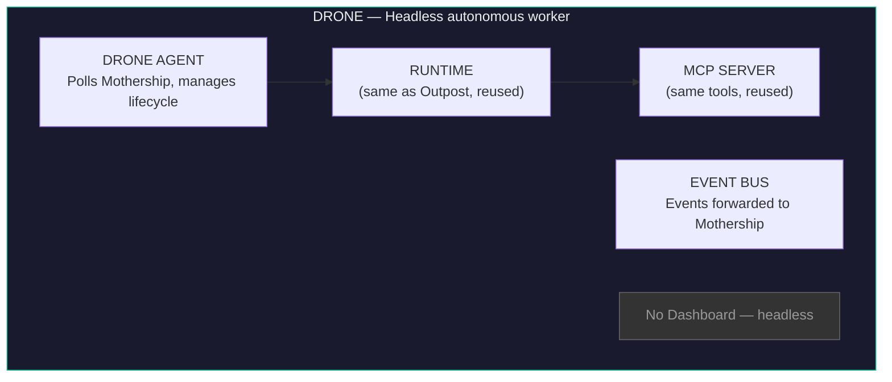
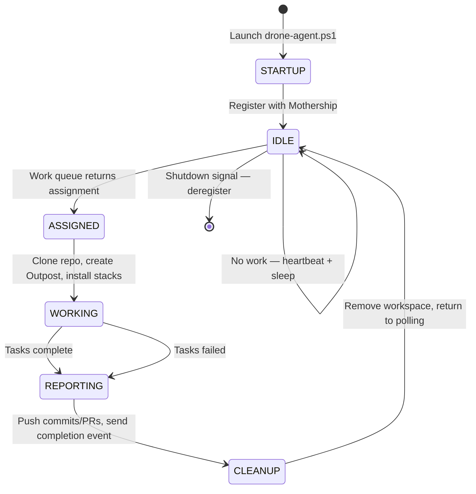
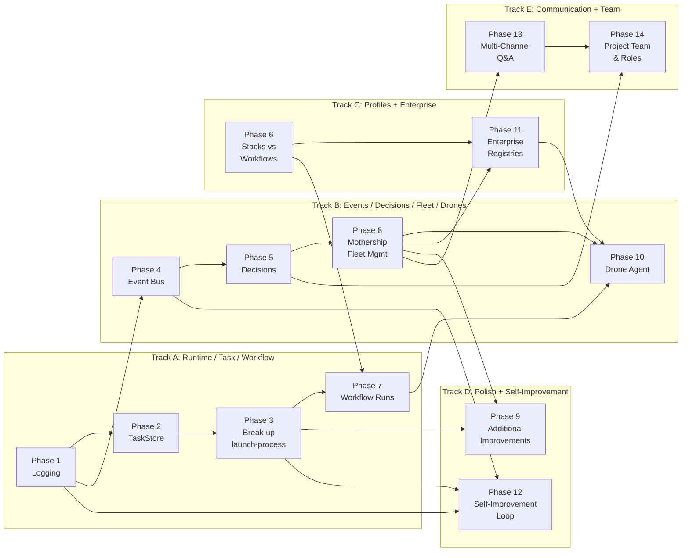

# Dotbot v3 Major Refactor Plan

## Context

Dotbot v3 has grown organically and now suffers from architectural tensions: profiles conflate stacks and workflows, task/process management is brittle and monolithic, workflows are locked at init time, there's no decision tracking, logging is ad-hoc, the event/feedback system is tightly coupled, and there's no support for remote headless AI agents. This plan addresses all of these while establishing a clean component architecture with Outposts (local dev workspaces), Drones (headless autonomous workers), and a Mothership (central fleet management and work dispatch).

---

## Component Architecture

### Overview

Dotbot is composed of nine distinct architectural components. Each has a clear identity and responsibility boundary.

#### Fleet Topology

#### Outpost Internals

#### Drone Internals

### 1. Outpost (`.bot/`)

The **Outpost** is the per-project workspace directory. It's where dotbot lives in each repository — the local installation of all dotbot capabilities.

**Contains:**
- `systems/` — runtime, MCP server, UI server
- `prompts/` — agents, skills, workflows
- `workspace/` — tasks, plans, decisions, sessions, workflow runs, product docs
- `defaults/` — settings
- `.control/` — runtime state, logs, processes (gitignored)
- `hooks/` — verification, dev lifecycle, automation scripts

**Key property:** Each outpost is self-contained. You can have multiple repos each with their own outpost, all managed independently or connected to a mothership.

**Architectural name for docs:** "Outpost" — evokes a self-sufficient station that can operate autonomously but reports to a mothership.

### 2. Runtime

The process orchestration engine that drives all work.

**Current:** `launch-process.ps1` (2,924 lines) — monolithic
**Target:** Decomposed into ProcessRegistry + TaskLoop + per-type handlers

**Responsibilities:**
- Process lifecycle (create, track, stop, clean up)
- Task loop (get-next, invoke LLM, check completion, retry)
- Worktree isolation (branch per task, squash-merge on completion)
- Provider CLI abstraction (Claude, Codex, Gemini)

### 3. MCP Server

The tool layer — auto-discovers and executes tools for the LLM.

**Current:** `dotbot-mcp.ps1` (261 lines) + 26 tools in `tools/*/`
**Target:** Same architecture, expanded with workflow/decision/event tools

**Key modules:**
- `TaskIndexCache.psm1` — read-only task query cache
- `TaskStore.psm1` — (NEW) atomic task state transitions
- `SessionTracking.psm1` — session state
- `NotificationClient.psm1` — mothership communication

### 4. Dashboard

The local web UI for monitoring and control.

**Current:** `server.ps1` (1,533 lines) + 9 modules + vanilla JS frontend
**Target:** Same architecture, extended with new tabs (Decisions, Workflows, Fleet)

### 5. Mothership

The centralized .NET server for fleet-wide management and work dispatch.

**Current:** `server/` — ASP.NET Core app with Teams/Email/Jira question delivery
**Target:** Extended to full fleet management: instance registry, heartbeat monitoring, cross-org decision routing, fleet dashboard, **work queue for Drone dispatch**

### 6. Event Bus

**NEW.** Internal pub/sub system for dotbot events. Currently, Aether is hardwired into the UI's polling loop. The mothership notifications are triggered directly from MCP tools. These need to be decoupled.

**Event types:**
- `task.started`, `task.completed`, `task.failed`
- `process.started`, `process.stopped`
- `decision.created`, `decision.accepted`
- `workflow.started`, `workflow.phase_completed`, `workflow.completed`
- `drone.registered`, `drone.assigned`, `drone.completed`, `drone.failed`, `drone.idle`
- `activity.write`, `activity.edit`, `activity.bash`
- `error`, `rate_limit`

**Event sinks (plugins):**
- **Aether** — Hue lights (existing, refactored to subscribe to events)
- **Webhooks** — POST to arbitrary URLs (NEW)
- **Mothership** — sync events to central server (existing NotificationClient, refactored)
- **Future:** WLED, Nanoleaf, sound, Slack, desktop notifications

### 7. Stacks & Workflows

**Stacks** = composable technology overlays (dotnet, dotnet-blazor, dotnet-ef).
**Workflows** = launchable multi-phase pipelines (kickstart-via-jira, kickstart-via-pr).

These are the two "extension" mechanisms, cleanly separated.

### 8. Drones

**NEW.** Headless autonomous AI coding agents running in data centers, managed by the Mothership.

A **Drone** is a dotbot instance without a local developer. It runs the same Runtime and MCP Server as an Outpost but has no Dashboard. Instead, it has a **Drone Agent** — a lightweight supervisor that:

1. **Registers** with the Mothership on startup (capabilities, available providers/models, capacity)
2. **Polls** the Mothership work queue for assignments
3. **Clones** target repos and creates ephemeral Outposts
4. **Executes** work using any configured provider (Claude Code, Codex, Gemini)
5. **Reports** progress via heartbeat and event forwarding
6. **Returns** results (commits, PRs, artifacts) and cleans up

**Drone vs Outpost:**

| Aspect | Outpost | Drone |
|--------|---------|-------|
| Operator | Local developer | None (autonomous) |
| Dashboard | Yes (web UI) | No (headless) |
| Work source | Developer-initiated | Mothership work queue |
| Lifecycle | Persistent (lives with repo) | Ephemeral (per-assignment) |
| Providers | Single (developer's choice) | Multiple (configured per-drone) |
| Steering | Developer whispers | Mothership commands |

**Drone lifecycle:**

**Key architectural property:** Drones reuse the same Runtime, MCP Server, and ProviderCLI as Outposts. The only new code is the Drone Agent supervisor and the Mothership work dispatch system. The existing provider abstraction (`ProviderCLI.psm1` + declarative `providers/*.json`) means a Drone can run Claude, Codex, or Gemini without code changes.

**Existing foundation:**
- `profiles/default/systems/runtime/ProviderCLI/ProviderCLI.psm1` — multi-provider abstraction
- `profiles/default/defaults/providers/{claude,codex,gemini}.json` — declarative provider configs
- `profiles/default/systems/runtime/launch-process.ps1` — process orchestration (already headless-capable)
- `profiles/default/systems/runtime/modules/WorktreeManager.psm1` — git worktree isolation (enables parallel tasks)

---

## Implementation Phases

### Phase 1: Structured Logging Module (Foundation)

> **Effort:** S-M | **Risk:** Low | **Dependencies:** None
>
> Creates `DotBotLog.psm1` with structured JSONL logging, replaces all silent catch blocks, adds log rotation. Every subsequent phase benefits from proper logging.
>
> **[Full specification →](DOTBOT-V4-phase-01-structured-logging.md)**

---

### Phase 2: TaskStore Abstraction

> **Effort:** S | **Risk:** Low | **Dependencies:** None
>
> Creates `TaskStore.psm1` with atomic state transitions (`Move-TaskState`), unified lookup, and record CRUD. `TaskIndexCache.psm1` becomes read-only query layer.
>
> **[Full specification →](DOTBOT-V4-phase-02-taskstore-abstraction.md)**

---

### Phase 3: Break Up launch-process.ps1

> **Effort:** L | **Risk:** Medium | **Dependencies:** Phase 1, 2
>
> Decomposes the 2,924-line monolith into ~200-line dispatcher + `ProcessRegistry.psm1` + `TaskLoop.psm1` + per-type handler scripts (`Invoke-AnalysisProcess.ps1`, etc.).
>
> **[Full specification →](DOTBOT-V4-phase-03-launch-process-breakup.md)**

---

### Phase 4: Event Bus

> **Effort:** M | **Risk:** Medium | **Dependencies:** Phase 1
>
> Lightweight in-process pub/sub (`EventBus.psm1`) with plugin sinks (Aether, Webhooks, Mothership). Decouples event producers from consumers.
>
> **[Full specification →](DOTBOT-V4-phase-04-event-bus.md)**

---

### Phase 5: Rich Decision Records

> **Effort:** S-M | **Risk:** Low | **Dependencies:** Phase 4 (for events)
>
> Structured decision JSON in `workspace/decisions/`, 5 MCP tools (`decision-create/list/get/update/link`), new Dashboard tab, integration with analysis/execution prompts.
>
> **[Full specification →](DOTBOT-V4-phase-05-decision-records.md)**

---

### Phase 6: Restructure Profiles — Separate Stacks from Workflows

> **Effort:** M | **Risk:** Medium | **Dependencies:** None
>
> Splits `profiles/` into stacks-only + new top-level `workflows/` directory. Introduces `workflow.yaml` definitions. Adds `dotbot run` and `dotbot workflows` CLI commands.
>
> **[Full specification →](DOTBOT-V4-phase-06-profiles-stacks-workflows.md)**

---

### Phase 7: Workflows as Isolated Runs

> **Effort:** L | **Risk:** High | **Dependencies:** Phase 3, 6
>
> `dotbot run` creates workflow run records, generates tasks per phase, isolates task queues per run. Adds `WorkflowRunner.psm1` and workflow MCP tools.
>
> **[Full specification →](DOTBOT-V4-phase-07-workflow-isolated-runs.md)**

---

### Phase 8: Mothership Fleet Management

> **Effort:** L | **Risk:** Medium | **Dependencies:** Phase 4, 5
>
> Extends the .NET Mothership to full fleet management: instance registry, heartbeats, work queue for Drone dispatch, fleet dashboard, decision sync, event forwarding. Renames `NotificationClient` → `MothershipClient`.
>
> **[Full specification →](DOTBOT-V4-phase-08-mothership-fleet.md)**

---

### Phase 9: Additional Improvements

> **Effort:** S each | **Risk:** Low | **Dependencies:** Phases 1-8
>
> Four polish items: (9a) Health check system (`doctor.ps1`), (9b) Process telemetry, (9c) Idempotent init, (9d) Configuration validation.
>
> **[Full specification →](DOTBOT-V4-phase-09-additional-improvements.md)**

---

### Phase 10: Drone Agent

> **Effort:** L | **Risk:** High | **Dependencies:** Phase 7, 8
>
> Headless autonomous worker that polls the Mothership for work, clones repos, executes tasks, and reports results. Includes `drone-agent.ps1`, `DroneAgent.psm1`, Docker support, and Mothership command steering.
>
> **[Full specification →](DOTBOT-V4-phase-10-drone-agent.md)**

---

### Phase 11: Enterprise Extension Registries

> **Effort:** M | **Risk:** Medium | **Dependencies:** Phase 6, 8 (for Mothership discovery)
>
> Git-based extension registries with namespace prefixes (`myorg:workflow-name`). CLI commands for registry management, `RegistryManager.psm1`, Mothership discovery, Drone integration.
>
> **[Full specification →](DOTBOT-V4-phase-11-enterprise-registries.md)**

---

### Phase 12: Self-Improvement Loop

> **Effort:** M | **Risk:** Medium | **Dependencies:** Phase 1, 3, 4
>
> Automated analysis of activity logs and task outcomes to generate evidence-based improvement suggestions for prompts, skills, workflows. Includes `93-self-improvement.md` workflow, MCP tools, and Dashboard tab.
>
> **[Full specification →](DOTBOT-V4-phase-12-self-improvement.md)**

---

### Phase 13: Multi-Channel Q&A with Attachments & Questionnaires

> **Effort:** L | **Risk:** Medium | **Dependencies:** Phase 8
>
> Adds Slack, Discord, WhatsApp, and Web delivery channels. Introduces file attachments, review links, and batched questionnaires with conditional questions and completion policies.
>
> **[Full specification →](DOTBOT-V4-phase-13-multi-channel-qa.md)**

---

### Phase 14: Project Team & Roles

> **Effort:** M | **Risk:** Medium | **Dependencies:** Phase 5, 13
>
> Structured team registry with roles, domains, channel preferences, and availability/delegation. Drives Q&A routing, decision stakeholders, and review requests. Syncs to Mothership for fleet-wide visibility.
>
> **[Full specification →](DOTBOT-V4-phase-14-project-team-roles.md)**

---

## Implementation Order

| # | Phase | Effort | Risk | Dependencies |
|---|-------|--------|------|--------------|
| 1 | Structured Logging | S-M | Low | None |
| 2 | TaskStore Abstraction | S | Low | None |
| 3 | Break up launch-process.ps1 | L | Medium | 1, 2 |
| 4 | Event Bus | M | Medium | 1 |
| 5 | Rich Decision Records | S-M | Low | 4 (for events) |
| 6 | Restructure Profiles | M | Medium | None |
| 7 | Workflows as Isolated Runs | L | High | 3, 6 |
| 8 | Mothership Fleet Management | L | Medium | 4, 5 |
| 9 | Additional improvements | S each | Low | 1-8 |
| 10 | Drone Agent | L | High | 7, 8 |
| 11 | Enterprise Extension Registries | M | Medium | 6, 8 (for Mothership discovery) |
| 12 | Self-Improvement Loop | M | Medium | 1, 3, 4 |
| 13 | Multi-Channel Q&A | L | Medium | 8 |
| 14 | Project Team & Roles | M | Medium | 5, 13 |

**Parallel tracks:**

**Key dependencies:**
- **Phase 10 (Drones)** depends on Phase 7 (workflow runs), Phase 8 (Mothership fleet), and Phase 11 (registries — Drones need to resolve `myorg:workflow` references)
- **Phase 11 (Enterprise Registries)** depends on Phase 6 (stacks/workflows separation must exist first) and Phase 8 (for optional Mothership discovery)
- **Phase 12 (Self-Improvement)** depends on Phase 1 (structured logs for analysis), Phase 3 (runtime integration for task completion trigger), and Phase 4 (event bus for improvement events)
- **Phase 13 (Multi-Channel Q&A)** depends on Phase 8 (Mothership fleet management must exist for delivery infrastructure)
- **Phase 14 (Project Team & Roles)** depends on Phase 5 (decisions — team drives stakeholder resolution) and Phase 13 (Q&A — team drives recipient routing)

---

## Verification

After each phase:
1. `pwsh install.ps1`
2. `pwsh tests/Run-Tests.ps1` (layers 1-3)
3. Phase-specific checks:
   - Phase 1: Structured JSONL in logs, no silent catches
   - Phase 2: Task state transitions atomic and validated
   - Phase 3: All process types dispatch correctly
   - Phase 4: Events published and sinks receive them
   - Phase 5: Decisions CRUD + UI tab
   - Phase 6: `dotbot init --profile dotnet` works, workflows separate
   - Phase 7: `dotbot run` creates isolated run with tasks
   - Phase 8: Outpost registers with mothership, heartbeats flow
   - Phase 9: `dotbot doctor` reports health
   - Phase 10: Drone registers, polls work, executes assignment, reports completion
   - Phase 11: `dotbot registry add/list/update`, `dotbot init --profile myorg:stack`, `dotbot run myorg:workflow`
   - Phase 12: Self-improvement cycle generates suggestions, UI displays them, apply/reject works, counter resets
   - Phase 13: Slack/Discord/WhatsApp delivery works, attachments upload and render per channel, questionnaires collect batched responses
   - Phase 14: Team CRUD via MCP tools, role-based Q&A routing resolves correct recipients, availability/delegation works

## Key Files Referenced

| File | Lines | Role |
|------|-------|------|
| `profiles/default/systems/runtime/launch-process.ps1` | 2,924 | Monolith to decompose |
| `scripts/init-project.ps1` | 977 | Init to simplify |
| `profiles/default/systems/mcp/modules/TaskIndexCache.psm1` | — | Task query layer |
| `profiles/default/systems/runtime/modules/ui-rendering.ps1` | — | Activity logging |
| `profiles/default/systems/runtime/ClaudeCLI/ClaudeCLI.psm1` | 1,232 | CLI wrapper |
| `profiles/default/defaults/settings.default.json` | 77 | Settings hub |
| `profiles/default/systems/ui/server.ps1` | 1,533 | Dashboard server |
| `profiles/default/systems/ui/modules/AetherAPI.psm1` | 290 | Hue bridge integration |
| `profiles/default/systems/mcp/modules/NotificationClient.psm1` | 350 | Mothership client |
| `profiles/default/systems/ui/static/modules/aether.js` | 930 | Aether frontend |
| `profiles/default/systems/runtime/ProviderCLI/ProviderCLI.psm1` | 464 | Multi-provider abstraction (Claude/Codex/Gemini) |
| `profiles/default/defaults/providers/{claude,codex,gemini}.json` | ~30 ea | Declarative provider configs |
| `server/src/Dotbot.Server/` | — | Mothership .NET server |
