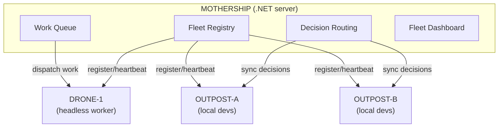
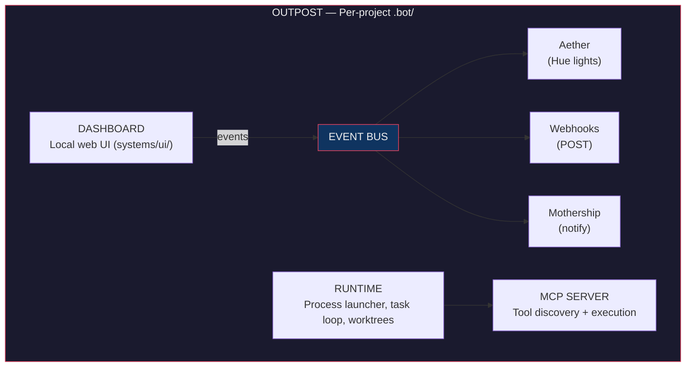
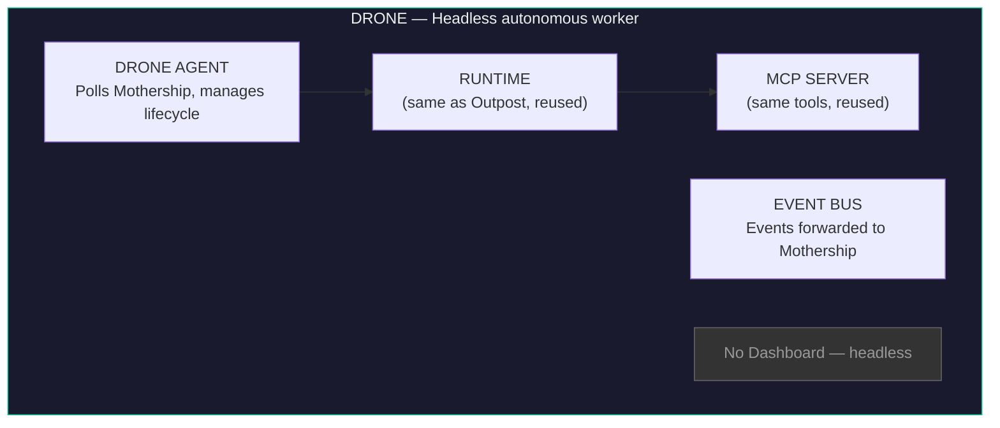
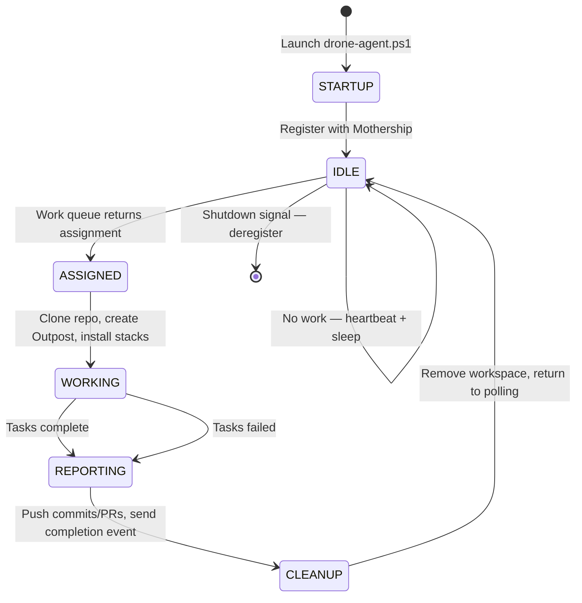
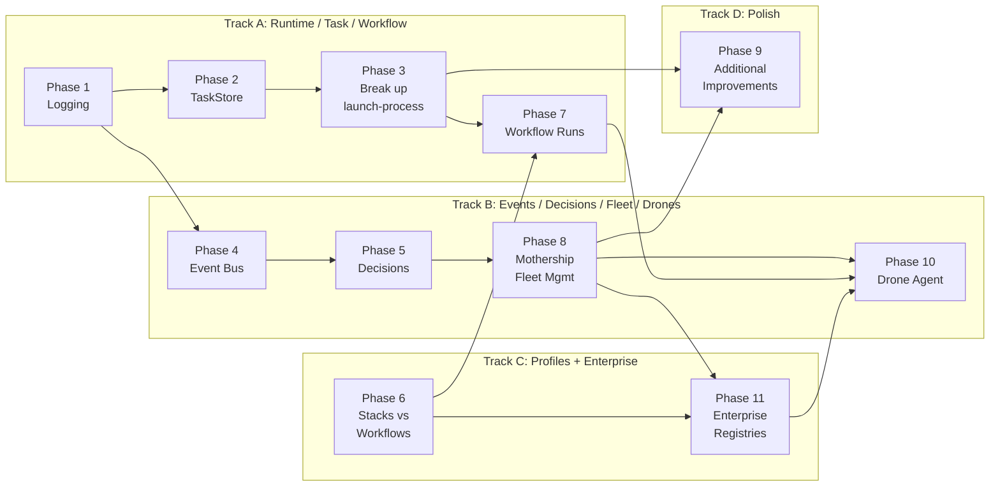

# Dotbot v3 Major Refactor Plan

## Context

Dotbot v3 has grown organically and now suffers from architectural tensions: profiles conflate stacks and workflows, task/process management is brittle and monolithic, workflows are locked at init time, there's no decision tracking, logging is ad-hoc, the event/feedback system is tightly coupled, and there's no support for remote headless AI agents. This plan addresses all of these while establishing a clean component architecture with Outposts (local dev workspaces), Drones (headless autonomous workers), and a Mothership (central fleet management and work dispatch).

---

## Component Architecture

### Overview

Dotbot is composed of eight distinct architectural components. Each has a clear identity and responsibility boundary.

#### Fleet Topology



#### Outpost Internals



#### Drone Internals



### 1. Outpost (`.bot/`)

The **Outpost** is the per-project workspace directory. It's where dotbot lives in each repository — the local installation of all dotbot capabilities.

**Contains:**
- `systems/` — runtime, MCP server, UI server
- `prompts/` — agents, skills, workflows
- `workspace/` — tasks, plans, decisions, sessions, workflow runs, product docs
- `defaults/` — settings
- `.control/` — runtime state, logs, processes (gitignored)
- `hooks/` — verification, dev lifecycle, automation scripts

**Key property:** Each outpost is self-contained. You can have multiple repos each with their own outpost, all managed independently or connected to a mothership.

**Architectural name for docs:** "Outpost" — evokes a self-sufficient station that can operate autonomously but reports to a mothership.

### 2. Runtime

The process orchestration engine that drives all work.

**Current:** `launch-process.ps1` (2,924 lines) — monolithic
**Target:** Decomposed into ProcessRegistry + TaskLoop + per-type handlers

**Responsibilities:**
- Process lifecycle (create, track, stop, clean up)
- Task loop (get-next, invoke LLM, check completion, retry)
- Worktree isolation (branch per task, squash-merge on completion)
- Provider CLI abstraction (Claude, Codex, Gemini)

### 3. MCP Server

The tool layer — auto-discovers and executes tools for the LLM.

**Current:** `dotbot-mcp.ps1` (261 lines) + 26 tools in `tools/*/`
**Target:** Same architecture, expanded with workflow/decision/event tools

**Key modules:**
- `TaskIndexCache.psm1` — read-only task query cache
- `TaskStore.psm1` — (NEW) atomic task state transitions
- `SessionTracking.psm1` — session state
- `NotificationClient.psm1` — mothership communication

### 4. Dashboard

The local web UI for monitoring and control.

**Current:** `server.ps1` (1,533 lines) + 9 modules + vanilla JS frontend
**Target:** Same architecture, extended with new tabs (Decisions, Workflows, Fleet)

### 5. Mothership

The centralized .NET server for fleet-wide management and work dispatch.

**Current:** `server/` — ASP.NET Core app with Teams/Email/Jira question delivery
**Target:** Extended to full fleet management: instance registry, heartbeat monitoring, cross-org decision routing, fleet dashboard, **work queue for Drone dispatch**

### 6. Event Bus

**NEW.** Internal pub/sub system for dotbot events. Currently, Aether is hardwired into the UI's polling loop. The mothership notifications are triggered directly from MCP tools. These need to be decoupled.

**Event types:**
- `task.started`, `task.completed`, `task.failed`
- `process.started`, `process.stopped`
- `decision.created`, `decision.accepted`
- `workflow.started`, `workflow.phase_completed`, `workflow.completed`
- `drone.registered`, `drone.assigned`, `drone.completed`, `drone.failed`, `drone.idle`
- `activity.write`, `activity.edit`, `activity.bash`
- `error`, `rate_limit`

**Event sinks (plugins):**
- **Aether** — Hue lights (existing, refactored to subscribe to events)
- **Webhooks** — POST to arbitrary URLs (NEW)
- **Mothership** — sync events to central server (existing NotificationClient, refactored)
- **Future:** WLED, Nanoleaf, sound, Slack, desktop notifications

### 7. Stacks & Workflows

**Stacks** = composable technology overlays (dotnet, dotnet-blazor, dotnet-ef).
**Workflows** = launchable multi-phase pipelines (kickstart-via-jira, kickstart-via-pr).

These are the two "extension" mechanisms, cleanly separated.

### 8. Drones

**NEW.** Headless autonomous AI coding agents running in data centers, managed by the Mothership.

A **Drone** is a dotbot instance without a local developer. It runs the same Runtime and MCP Server as an Outpost but has no Dashboard. Instead, it has a **Drone Agent** — a lightweight supervisor that:

1. **Registers** with the Mothership on startup (capabilities, available providers/models, capacity)
2. **Polls** the Mothership work queue for assignments
3. **Clones** target repos and creates ephemeral Outposts
4. **Executes** work using any configured provider (Claude Code, Codex, Gemini)
5. **Reports** progress via heartbeat and event forwarding
6. **Returns** results (commits, PRs, artifacts) and cleans up

**Drone vs Outpost:**

| Aspect | Outpost | Drone |
|--------|---------|-------|
| Operator | Local developer | None (autonomous) |
| Dashboard | Yes (web UI) | No (headless) |
| Work source | Developer-initiated | Mothership work queue |
| Lifecycle | Persistent (lives with repo) | Ephemeral (per-assignment) |
| Providers | Single (developer's choice) | Multiple (configured per-drone) |
| Steering | Developer whispers | Mothership commands |

**Drone configuration** (`drone-config.yaml`):
```yaml
name: "drone-prod-01"
mothership:
  url: "https://mothership.example.com"
  api_key: "..."
  poll_interval_seconds: 10
providers:
  - name: claude
    env_key: ANTHROPIC_API_KEY
    models: [opus, sonnet]
  - name: codex
    env_key: OPENAI_API_KEY
    models: [gpt-5.2-codex]
  - name: gemini
    env_key: GEMINI_API_KEY
    models: [gemini-2.5-pro]
capabilities:
  max_concurrent: 3
  stacks: [dotnet, dotnet-blazor]
workspace_dir: /var/dotbot/workspaces
```

**Work assignment** (dispatched by Mothership):
```json
{
  "id": "assign-abc123",
  "type": "workflow-run|task|prompt",
  "priority": 1,
  "repo": {
    "url": "https://github.com/org/repo.git",
    "branch": "main",
    "credentials_ref": "github-pat-01"
  },
  "workflow": "kickstart-via-jira",
  "provider": "claude",
  "model": "opus",
  "stacks": ["dotnet"],
  "parameters": {},
  "deadline": "2026-03-15T00:00:00Z"
}
```

**Drone lifecycle:**



**Key architectural property:** Drones reuse the same Runtime, MCP Server, and ProviderCLI as Outposts. The only new code is the Drone Agent supervisor and the Mothership work dispatch system. The existing provider abstraction (`ProviderCLI.psm1` + declarative `providers/*.json`) means a Drone can run Claude, Codex, or Gemini without code changes.

**Existing foundation:**
- `profiles/default/systems/runtime/ProviderCLI/ProviderCLI.psm1` — multi-provider abstraction
- `profiles/default/defaults/providers/{claude,codex,gemini}.json` — declarative provider configs
- `profiles/default/systems/runtime/launch-process.ps1` — process orchestration (already headless-capable)
- `profiles/default/systems/runtime/modules/WorktreeManager.psm1` — git worktree isolation (enables parallel tasks)

---

## Phase 1: Structured Logging Module (Foundation)

**Why first:** Every subsequent phase benefits from proper logging.

### Create `DotBotLog.psm1`
- **Path:** `profiles/default/systems/runtime/modules/DotBotLog.psm1`
- Functions:
  - `Write-BotLog -Level {Debug|Info|Warn|Error|Fatal} -Message <string> -Context <hashtable> -Exception <ErrorRecord>`
  - `Initialize-DotBotLog -LogDir <path> -MinLevel <level>`
  - `Rotate-DotBotLog` — removes files older than 7 days
- Output: structured JSONL to `.bot/.control/logs/dotbot-{date}.jsonl`
- Each line: `{ts, level, msg, process_id, task_id, phase, pid, error, stack}`
- Activity log integration: Info+ events also go to `activity.jsonl` for backward compat
- `Write-Diag` becomes a thin wrapper: `Write-BotLog -Level Debug`
- `Write-ActivityLog` delegates internally to `Write-BotLog`

### Settings addition
```json
"logging": {
  "console_level": "Info",
  "file_level": "Debug",
  "retention_days": 7,
  "max_file_size_mb": 50
}
```

### Replace silent catch blocks
All 25+ `catch {}` blocks become:
```powershell
catch { Write-BotLog -Level Warn -Message "..." -Exception $_ }
```

### Files
- Create: `profiles/default/systems/runtime/modules/DotBotLog.psm1`
- Modify: `profiles/default/defaults/settings.default.json`
- Modify: `profiles/default/systems/runtime/launch-process.ps1`
- Modify: `profiles/default/systems/runtime/modules/ui-rendering.ps1`
- Add to init: `.bot/.control/logs/`

---

## Phase 2: TaskStore Abstraction

### Create `TaskStore.psm1`
- **Path:** `profiles/default/systems/mcp/modules/TaskStore.psm1`
- Functions:
  - `Move-TaskState -TaskId <id> -From <status> -To <status>` — atomic, validated
  - `Get-TaskByIdOrSlug -Identifier <string>` — unified lookup
  - `New-TaskRecord -Properties <hashtable>` — create with defaults
  - `Update-TaskRecord -TaskId <id> -Updates <hashtable>` — merge-update
- `TaskIndexCache.psm1` becomes read-only query layer
- All `task-mark-*` tools use `Move-TaskState`

### Files
- Create: `profiles/default/systems/mcp/modules/TaskStore.psm1`
- Modify: `profiles/default/systems/mcp/tools/task-mark-*/script.ps1` (7 tools)
- Modify: `profiles/default/systems/mcp/modules/TaskIndexCache.psm1`

---

## Phase 3: Break Up launch-process.ps1

### New structure
```
systems/runtime/
  launch-process.ps1              # ~200 lines: parse args, preflight, dispatch
  modules/
    ProcessRegistry.psm1          # Process CRUD, locking, activity logging
    TaskLoop.psm1                 # Shared task iteration
    ProcessTypes/
      Invoke-AnalysisProcess.ps1
      Invoke-ExecutionProcess.ps1
      Invoke-WorkflowProcess.ps1
      Invoke-KickstartProcess.ps1
      Invoke-PromptProcess.ps1    # planning, commit, task-creation
```

### ProcessRegistry.psm1
Extracted from launch-process.ps1:
- `New-ProcessId`, `Write-ProcessFile`, `Write-ProcessActivity`
- `Test-ProcessStopSignal`, `Test-ProcessLock`, `Set-ProcessLock`, `Remove-ProcessLock`
- `Test-Preflight`

### TaskLoop.psm1
Shared iteration pattern (currently duplicated 3x in analysis/execution/workflow):
- `Invoke-TaskLoop -Strategy <scriptblock> -OnComplete <scriptblock>`
- `Wait-ForTasks` — wait-with-heartbeat
- `Invoke-WithRetry` — retry-with-rate-limit

### Files
- Gut: `launch-process.ps1` → ~200 line dispatcher
- Create: `modules/ProcessRegistry.psm1`
- Create: `modules/TaskLoop.psm1`
- Create: `modules/ProcessTypes/Invoke-{Analysis,Execution,Workflow,Kickstart,Prompt}Process.ps1`

---

## Phase 4: Event Bus

### Design
A lightweight in-process event system for the outpost.

**Path:** `profiles/default/systems/runtime/modules/EventBus.psm1`

```powershell
# Publishing events
Publish-DotBotEvent -Type "task.completed" -Data @{ task_id = $id; name = $name }

# Subscribing (plugins register at startup)
Register-DotBotEventSink -Name "aether" -Handler { param($Event) ... }
Register-DotBotEventSink -Name "webhooks" -Handler { param($Event) ... }
Register-DotBotEventSink -Name "mothership" -Handler { param($Event) ... }
```

**Event envelope:**
```json
{
  "id": "evt-abc123",
  "type": "task.completed",
  "timestamp": "2026-03-14T10:00:00Z",
  "source": "runtime",
  "data": { "task_id": "...", "name": "..." }
}
```

**File-based event log:** `.bot/.control/events.jsonl` — all events are persisted for replay and debugging.

**Plugin discovery:** Event sinks are loaded from `systems/events/sinks/` — each subfolder contains a `sink.psm1` with `Register-*` and `Invoke-*` functions.

```
systems/events/
  EventBus.psm1
  sinks/
    aether/sink.psm1       # Refactored from AetherAPI.psm1
    webhooks/sink.psm1     # NEW — POST events to configured URLs
    mothership/sink.psm1   # Refactored from NotificationClient.psm1
```

### Aether refactor
- Currently: `AetherAPI.psm1` (UI module) + `aether.js` (frontend) poll state and react
- Target: `aether/sink.psm1` subscribes to events via the bus. The UI frontend (`aether.js`) receives events via the existing polling/SSE mechanism and drives the Hue API calls.
- The Hue bridge interaction stays client-side (browser → API proxy → bridge) since it needs LAN access

### Webhook sink
```json
"webhooks": {
  "enabled": true,
  "endpoints": [
    {
      "url": "https://hooks.example.com/dotbot",
      "events": ["task.completed", "decision.created"],
      "secret": "hmac-secret"
    }
  ]
}
```

### Files
- Create: `profiles/default/systems/events/EventBus.psm1`
- Create: `profiles/default/systems/events/sinks/aether/sink.psm1`
- Create: `profiles/default/systems/events/sinks/webhooks/sink.psm1`
- Create: `profiles/default/systems/events/sinks/mothership/sink.psm1`
- Modify: `profiles/default/systems/ui/modules/AetherAPI.psm1` (delegate to sink)
- Modify: `profiles/default/systems/mcp/modules/NotificationClient.psm1` (delegate to sink)
- Modify: Runtime process types to emit events at lifecycle points
- Settings: Add `events` section to `settings.default.json`

---

## Phase 5: Rich Decision Records

### Directory
`.bot/workspace/decisions/`

### Decision JSON format
```json
{
  "id": "dec-a1b2c3d4",
  "title": "Use PostgreSQL for primary data store",
  "type": "architecture|business|technical|process",
  "status": "proposed|accepted|deprecated|superseded",
  "date": "2026-03-14",
  "context": "Why this decision was needed",
  "decision": "What was decided",
  "consequences": "What follows",
  "alternatives_considered": [
    {"option": "SQL Server", "reason_rejected": "Cost"}
  ],
  "stakeholders": ["@andre"],
  "related_task_ids": [],
  "related_decision_ids": [],
  "supersedes": null,
  "superseded_by": null,
  "tags": ["database"],
  "impact": "high|medium|low"
}
```

### MCP Tools
- `decision-create`, `decision-list`, `decision-get`, `decision-update`, `decision-link`

### Prompt integration
- `98-analyse-task.md`: check existing decisions for context
- `99-autonomous-task.md`: record decisions when making choices

### Web UI
- New "Decisions" tab
- `systems/ui/modules/DecisionAPI.psm1`

### Events
- `decision.created`, `decision.accepted`, `decision.superseded` events emitted via bus

### Files
- Create: `systems/mcp/tools/decision-{create,list,get,update,link}/` (5 tools)
- Create: `systems/ui/modules/DecisionAPI.psm1`
- Modify: `prompts/workflows/98-analyse-task.md`, `99-autonomous-task.md`
- Add to init: `workspace/decisions/`

---

## Phase 6: Restructure Profiles — Separate Stacks from Workflows

### Directory restructuring
```
profiles/         → stacks only
  default/        → base (always applied)
  dotnet/         → type: stack
  dotnet-blazor/  → type: stack (extends: dotnet)
  dotnet-ef/      → type: stack (extends: dotnet)

workflows/        → NEW top-level dir
  default/        → base workflow files (00-05, 90-91, 98-99)
  kickstart-via-jira/
  kickstart-via-pr/
```

### CLI
- `dotbot init --profile dotnet` — stacks (unchanged)
- `dotbot run kickstart-via-jira` — launch workflow (NEW)
- `dotbot workflows` — list available (NEW)

### Workflow definition (`workflow.yaml`)
```yaml
name: kickstart-via-jira
description: Research-driven initiative workflow
requires_stacks: []
mcp_tools:
  - atlassian-download
  - repo-clone
phases:
  - id: jira-context
    name: Fetch Jira Context
    type: llm
    prompt_file: 00-kickstart-interview.md
```

Phase definitions move from `settings.default.json` into `workflow.yaml`.

### Init changes
- `init-project.ps1` handles default + stacks only
- Base workflow files always installed
- No workflow replacement at init

### Files
- Move: `profiles/kickstart-via-jira/` → `workflows/kickstart-via-jira/`
- Move: `profiles/kickstart-via-pr/` → `workflows/kickstart-via-pr/`
- Modify: `scripts/init-project.ps1`
- Create: `systems/runtime/modules/WorkflowRegistry.psm1`
- Modify: `install.ps1`

---

## Phase 7: Workflows as Isolated Runs

### Concept
When `dotbot run kickstart-via-jira` is invoked:
1. Creates a **workflow run** at `.bot/workspace/workflow-runs/{wfrun-id}.json`
2. Generates a **task per phase** in a run-specific task queue
3. Dependencies encode phase ordering
4. Standard analysis/execution processes pick them up
5. UI shows the run as a self-contained entity

### Workflow Run record
```json
{
  "id": "wfrun-abc123",
  "workflow": "kickstart-via-jira",
  "status": "running|paused|completed|failed",
  "started_at": "2026-03-14T10:00:00Z",
  "phases_total": 15,
  "phases_completed": 3,
  "current_phase": "plan-atlassian-research",
  "task_ids": ["task-001", "task-002"]
}
```

### Task queue isolation
- Workflow tasks: `.bot/workspace/workflow-runs/{wfrun-id}/tasks/{status}/`
- Regular tasks: `.bot/workspace/tasks/{status}/`
- Each queue operates independently

### MCP tools
- `workflow-run`, `workflow-list`, `workflow-status`, `workflow-pause`, `workflow-resume`

### Events
- `workflow.started`, `workflow.phase_completed`, `workflow.completed` emitted via bus

### Files
- Create: `systems/mcp/tools/workflow-{run,list,status}/`
- Create: `systems/runtime/modules/WorkflowRunner.psm1`
- Add to init: `workspace/workflow-runs/`
- Modify: task system to support `workflow_run_id`

---

## Phase 8: Mothership Fleet Management

### Current state
- `server/` — .NET app for question delivery (Teams, Email, Jira)
- `NotificationClient.psm1` — outpost-side client for sending questions, polling responses
- Settings: `mothership.enabled`, `server_url`, `api_key`, `channel`, `recipients`

### Target: Full fleet management + Drone work dispatch

#### Instance Registry
Each outpost **and drone** registers with the mothership on startup:
```json
POST /api/fleet/register
{
  "instance_id": "guid",
  "instance_type": "outpost|drone",
  "project_name": "my-app",
  "project_description": "...",
  "stacks": ["dotnet", "dotnet-blazor"],
  "active_workflows": ["kickstart-via-jira"],
  "version": "3.x.x",
  "providers": ["claude", "codex"],
  "max_concurrent": 3
}
```

#### Heartbeat
Outposts send periodic heartbeats:
```json
POST /api/fleet/{instance_id}/heartbeat
{
  "status": "active|idle|error",
  "tasks": { "todo": 5, "in_progress": 1, "done": 12 },
  "active_processes": 2,
  "decisions_pending": 1,
  "last_activity": "2026-03-14T10:00:00Z"
}
```

#### Work Queue (for Drones)
The Mothership maintains a work queue that Drones poll for assignments:
```json
POST /api/fleet/work-queue/enqueue
{
  "type": "workflow-run|task|prompt",
  "priority": 1,
  "repo": {
    "url": "https://github.com/org/repo.git",
    "branch": "main",
    "credentials_ref": "github-pat-01"
  },
  "workflow": "kickstart-via-jira",
  "preferred_provider": "claude",
  "preferred_model": "opus",
  "required_stacks": ["dotnet"],
  "parameters": {},
  "deadline": "2026-03-15T00:00:00Z"
}

GET /api/fleet/work-queue/poll?drone_id={id}
# Returns next matching assignment based on drone capabilities

POST /api/fleet/work-queue/{assignment_id}/complete
{
  "status": "completed|failed",
  "result": { "commits": [...], "pr_url": "...", "decisions": [...] },
  "telemetry": { "duration_seconds": 320, "tokens_used": 150000 }
}
```

**Scheduling logic:** Match assignments to drones based on:
- Required stacks vs drone capabilities
- Preferred provider/model vs drone's available providers
- Current drone load vs max_concurrent
- Priority ordering

#### Fleet Dashboard
New server-side dashboard showing:
- All registered outposts **and drones** with status (active/idle/working/stale)
- Task counts across the fleet
- Pending decisions that need human input
- Active workflow runs
- **Drone work queue** — pending, assigned, and completed work items
- **Drone utilization** — load, success rate, average duration per drone
- Cross-org decision routing (a decision in one outpost can be routed to stakeholders in another)

#### Decision Sync
Decisions with `impact: high` or `stakeholders` that include cross-org references are synced to the mothership for routing:
```json
POST /api/fleet/{instance_id}/decisions
{
  "decision": { ... full decision record ... },
  "routing": { "stakeholders": ["andre@org.com"], "urgency": "normal" }
}
```

#### Event Forwarding
The mothership event sink forwards selected events to the central server:
```json
POST /api/fleet/{instance_id}/events
{
  "events": [
    { "type": "task.completed", "timestamp": "...", "data": { ... } }
  ]
}
```

### Outpost-side changes
- Enhance `NotificationClient.psm1` → `MothershipClient.psm1` with:
  - `Register-WithMothership`
  - `Send-Heartbeat`
  - `Sync-Decisions`
  - `Forward-Events`
- The mothership event sink (`sinks/mothership/sink.psm1`) handles event forwarding
- Heartbeat integrated into the dashboard's polling cycle

### Server-side changes
- New API controllers: `FleetController`, `DecisionRoutingController`, `WorkQueueController`
- New services: `WorkQueueService`, `DroneSchedulerService`, `DroneHealthService`
- New dashboard pages: Fleet overview, cross-org decision queue, drone management, work queue
- Instance health tracking with stale detection (drones get shorter stale threshold)
- Decision routing engine (match stakeholders to delivery channels)
- Work queue persistence (SQLite or file-based for simplicity)

### Settings evolution
```json
"mothership": {
  "enabled": false,
  "server_url": "",
  "api_key": "",
  "channel": "teams",
  "recipients": [],
  "project_name": "",
  "project_description": "",
  "heartbeat_interval_seconds": 60,
  "sync_tasks": true,
  "sync_questions": true,
  "sync_decisions": true,
  "sync_events": ["task.completed", "workflow.completed", "decision.created"],
  "fleet_dashboard": true
}
```

### Files
- Rename: `NotificationClient.psm1` → `MothershipClient.psm1` (with backward compat alias)
- Create: `systems/events/sinks/mothership/sink.psm1`
- Modify: `server/src/Dotbot.Server/` — new controllers, services, dashboard pages
- Modify: `profiles/default/defaults/settings.default.json`
- Server: Create `WorkQueueController.cs`, `WorkQueueService.cs`, `DroneSchedulerService.cs`

---

## Phase 10: Drone Agent

### Concept
A **Drone** is a headless dotbot worker that polls the Mothership for work, clones repos, executes tasks, and reports results. Drones reuse the existing Runtime, MCP Server, and ProviderCLI — the only new code is the supervisor agent and its lifecycle management.

### Drone Agent script
**Path:** `scripts/drone-agent.ps1`

The Drone Agent is a long-running PowerShell script that:
```powershell
# drone-agent.ps1 — Headless autonomous worker
param(
    [string]$ConfigPath = "./drone-config.yaml"  # Drone configuration
)

# 1. Load config (providers, capabilities, mothership URL)
# 2. Register with Mothership (POST /api/fleet/register with instance_type=drone)
# 3. Enter main loop:
#    a. Poll Mothership for work (GET /api/fleet/work-queue/poll)
#    b. If assignment received:
#       - Clone repo to workspace_dir
#       - Run dotbot init with required stacks
#       - Launch process (analysis, execution, or workflow)
#       - Stream events to Mothership via event bus
#       - On completion: push commits, create PR, report results
#       - Cleanup workspace
#    c. If no work: heartbeat + sleep(poll_interval)
# 4. On shutdown: deregister, cleanup active workspaces
```

### DroneAgent.psm1
**Path:** `profiles/default/systems/runtime/modules/DroneAgent.psm1`

Functions:
- `Initialize-Drone -Config <hashtable>` — load config, validate providers
- `Register-Drone -MothershipUrl <string> -ApiKey <string> -Capabilities <hashtable>` — register with mothership
- `Get-DroneAssignment -MothershipUrl <string> -DroneId <string>` — poll work queue
- `Invoke-DroneAssignment -Assignment <hashtable>` — clone, init, execute, report
- `Send-DroneHeartbeat -MothershipUrl <string> -DroneId <string> -Status <hashtable>` — periodic heartbeat
- `Complete-DroneAssignment -AssignmentId <string> -Result <hashtable>` — report completion
- `Remove-DroneWorkspace -WorkspacePath <string>` — cleanup after assignment

### Drone configuration format
**Path:** `defaults/drone-config.example.yaml`

```yaml
name: "drone-prod-01"
mothership:
  url: "https://mothership.example.com"
  api_key: "..."
  poll_interval_seconds: 10
  heartbeat_interval_seconds: 30
providers:
  - name: claude
    env_key: ANTHROPIC_API_KEY
    models: [opus, sonnet]
    default_model: opus
  - name: codex
    env_key: OPENAI_API_KEY
    models: [gpt-5.2-codex]
  - name: gemini
    env_key: GEMINI_API_KEY
    models: [gemini-2.5-pro]
capabilities:
  max_concurrent: 3
  stacks: [dotnet, dotnet-blazor, dotnet-ef]
workspace_dir: /var/dotbot/workspaces
cleanup_on_complete: true
git:
  credential_helper: "store"
  user_name: "dotbot-drone"
  user_email: "drone@dotbot.dev"
logging:
  level: Info
  forward_to_mothership: true
```

### Provider selection
When the Mothership dispatches work to a Drone:
- Assignment specifies `preferred_provider` and `preferred_model`
- Drone matches against its configured providers
- If preferred not available, falls back to any available provider
- The existing `ProviderCLI.psm1` handles the actual invocation — Drone just sets the provider config

### Credential management
- Provider API keys: environment variables (set per-drone, not per-assignment)
- Repo credentials: `credentials_ref` in assignment maps to a credential store on the Drone
- Mothership API key: in drone-config.yaml (or environment variable)
- Secrets never transit through the Mothership work queue

### Steering for Drones
- Outposts have developer "whisper" steering via JSONL files
- Drones get **Mothership commands** instead:
  - `POST /api/fleet/{drone_id}/command` with `{type: "stop|pause|resume|reassign"}`
  - Drone Agent polls for commands alongside heartbeat
  - Maps to the same internal stop-signal mechanism (`Test-ProcessStopSignal`)

### Docker support
**Path:** `docker/Dockerfile.drone`

```dockerfile
FROM mcr.microsoft.com/powershell:7.5-ubuntu-24.04
RUN apt-get update && apt-get install -y git
# Install provider CLIs (claude, codex, gemini)
COPY . /opt/dotbot
RUN pwsh /opt/dotbot/install.ps1
ENTRYPOINT ["pwsh", "/opt/dotbot/scripts/drone-agent.ps1"]
```

**Docker Compose for drone fleet:**
```yaml
services:
  drone-1:
    build: { context: ., dockerfile: docker/Dockerfile.drone }
    environment:
      - ANTHROPIC_API_KEY=${ANTHROPIC_API_KEY}
    volumes:
      - ./drone-config-1.yaml:/config/drone-config.yaml
      - drone-workspaces-1:/var/dotbot/workspaces
    command: ["-ConfigPath", "/config/drone-config.yaml"]
```

### Events
- `drone.registered` — Drone connects to Mothership
- `drone.assigned` — Drone receives work assignment
- `drone.working` — Drone starts task execution
- `drone.completed` — Drone finishes assignment successfully
- `drone.failed` — Drone assignment failed
- `drone.idle` — Drone has no work (heartbeat)

### Files
- Create: `scripts/drone-agent.ps1` — main entry point
- Create: `profiles/default/systems/runtime/modules/DroneAgent.psm1` — Drone lifecycle functions
- Create: `defaults/drone-config.example.yaml` — example configuration
- Create: `docker/Dockerfile.drone` — containerized Drone
- Create: `docker/docker-compose.drone.yaml` — multi-drone deployment
- Server: Extend `FleetController` with work queue endpoints
- Server: Create `WorkQueueService.cs`, `DroneSchedulerService.cs`

---

## Phase 11: Enterprise Extension Registries

### Concept
Organizations need proprietary workflows, stacks, tools, skills, agents, and hooks customized to their environments, systems, and internal tooling. An **Extension Registry** is a git-compatible repository with a known directory structure that dotbot can discover, cache, and consume. Enterprise content is referenced via a **namespace prefix** (e.g., `myorg:onboard-new-service`) to avoid collisions with built-in names.

Git repos are the source of truth. The Mothership optionally acts as a discovery layer — pointing Outposts and Drones to approved registries for the org — but is not required.

### Enterprise extension repo structure

```
dotbot-extensions/                    # Any git-compatible repo
  registry.yaml                       # Registry metadata
  stacks/
    internal-api/
      profile.yaml                    # type: stack
      defaults/settings.default.json
      hooks/verify/...
      systems/mcp/tools/...
      prompts/skills/...
    data-platform/
      profile.yaml
      ...
  workflows/
    onboard-new-service/
      workflow.yaml                   # Phase pipeline definition
      prompts/workflows/...           # Workflow prompt files
      systems/mcp/tools/...           # Workflow-specific tools
    compliance-audit/
      workflow.yaml
      ...
  tools/                              # Standalone MCP tools (no stack/workflow)
    jira-sync/
      metadata.yaml
      script.ps1
    internal-deploy/
      metadata.yaml
      script.ps1
  skills/                             # Standalone skills
    our-coding-standards/
      ...
  agents/                             # Custom AI personas
    security-reviewer/
      ...
  hooks/                              # Org-wide hooks
    verify/
      04-compliance-check.ps1
  defaults/
    settings.overlay.json             # Org-wide settings overlay
```

### Registry metadata (`registry.yaml`)

```yaml
name: myorg
display_name: "Acme Corp Dotbot Extensions"
description: "Internal workflows, stacks, and tools for Acme engineering"
version: "1.2.0"
min_dotbot_version: "4.0.0"
maintainers:
  - platform-team@acme.com
content:
  stacks: [internal-api, data-platform]
  workflows: [onboard-new-service, compliance-audit]
  tools: [jira-sync, internal-deploy]
  skills: [our-coding-standards]
  agents: [security-reviewer]
```

### CLI commands

```bash
# Registry management
dotbot registry add myorg https://dev.azure.com/org/dotbot-extensions
dotbot registry add myorg https://dev.azure.com/org/dotbot-extensions --branch release/v2
dotbot registry list
dotbot registry update [name]          # Fetch latest from remote
dotbot registry remove myorg

# Using enterprise content (namespace prefix)
dotbot init --profile myorg:internal-api
dotbot init --profile dotnet,myorg:internal-api    # Combine built-in + enterprise stacks
dotbot run myorg:onboard-new-service
dotbot run myorg:compliance-audit

# Discovery
dotbot workflows                       # Lists built-in AND enterprise workflows
dotbot stacks                          # Lists built-in AND enterprise stacks
```

### Local cache

- Registries are shallow-cloned to `~/dotbot/registries/{name}/`
- Shallow clone for bandwidth efficiency (`--depth 1`)
- Auto-update on `dotbot init` or `dotbot run` (configurable: `auto_update: true|false`)
- Offline mode: use cached version if network unavailable, emit warning
- Cache age threshold: warn if cache is older than N days (configurable)

### Configuration

**Global registry config** (`~/dotbot/registries.json`):
```json
{
  "registries": [
    {
      "name": "myorg",
      "url": "https://dev.azure.com/org/dotbot-extensions",
      "branch": "main",
      "auth": "credential-helper",
      "auto_update": true,
      "cache_max_age_days": 7
    }
  ]
}
```

**Per-project override** (`.bot/.control/settings.json`):
```json
{
  "registries": [
    {
      "name": "myorg",
      "branch": "feature/new-workflow"
    }
  ]
}
```

Per-project overrides merge with global config — useful for testing a registry branch before merging.

### Namespace resolution

When dotbot encounters `myorg:internal-api`:

1. Look up `myorg` in configured registries
2. Ensure local cache exists (clone if not, update if stale)
3. Resolve the content type:
   - `dotbot init --profile myorg:internal-api` → look in `registries/myorg/stacks/internal-api/`
   - `dotbot run myorg:onboard-new-service` → look in `registries/myorg/workflows/onboard-new-service/`
4. Apply using the same overlay/execution mechanisms as built-in content

**Resolution order for name collisions:**
- Namespaced names never collide (different namespace = different content)
- Unqualified names (no prefix) always resolve to built-in content
- Enterprise content MUST use its namespace prefix — no implicit override

### Mothership discovery (optional)

When an Outpost or Drone connects to the Mothership, it can receive a list of approved registries:

```json
GET /api/fleet/registries
{
  "registries": [
    {
      "name": "myorg",
      "url": "https://dev.azure.com/org/dotbot-extensions",
      "branch": "main",
      "required": true,
      "description": "Acme Corp standard extensions"
    }
  ]
}
```

- `required: true` — Outpost/Drone must configure this registry to participate in the fleet
- On first Mothership connection, registries are auto-configured (with user confirmation for Outposts, auto for Drones)
- Mothership can push registry updates (new repos, branch changes) via the existing heartbeat response

### Drone integration

When the Mothership dispatches work to a Drone:

```json
{
  "id": "assign-abc123",
  "workflow": "myorg:onboard-new-service",
  "required_registries": ["myorg"],
  ...
}
```

The Drone Agent:
1. Checks if `myorg` registry is configured and cached
2. If not, fetches registry config from Mothership and clones
3. Resolves `myorg:onboard-new-service` from the cached registry
4. Proceeds with normal workflow execution

### Security considerations

- Git authentication handles access control (SSH keys, PATs, credential helpers)
- Registry content is code — subject to the same review/PR/approval process as any enterprise code
- Optional integrity: `registry.yaml` can include content hashes for tamper detection
- Registries from unknown sources require explicit `dotbot registry add` — no auto-discovery without Mothership trust
- `.env.local` patterns in enterprise repos are gitignored by convention

### RegistryManager.psm1

**Path:** `profiles/default/systems/runtime/modules/RegistryManager.psm1`

Functions:
- `Add-DotBotRegistry -Name <string> -Url <string> -Branch <string>` — add to global config, initial clone
- `Remove-DotBotRegistry -Name <string>` — remove config and cached clone
- `Update-DotBotRegistry -Name <string>` — git fetch + reset to latest
- `Get-DotBotRegistries` — list all configured registries with status
- `Resolve-RegistryContent -Namespace <string> -ContentName <string> -ContentType <stack|workflow|tool|skill|agent>` — find content path in cache
- `Test-RegistryStale -Name <string>` — check if cache exceeds max age
- `Sync-RegistriesFromMothership -MothershipUrl <string>` — fetch approved registry list

### Files

- Create: `profiles/default/systems/runtime/modules/RegistryManager.psm1`
- Modify: `scripts/init-project.ps1` — resolve `namespace:stack` references during init
- Modify: `systems/runtime/modules/WorkflowRegistry.psm1` — resolve `namespace:workflow` references
- Modify: `install.ps1` — add `dotbot registry` subcommand
- Modify: `profiles/default/systems/runtime/modules/DroneAgent.psm1` — registry sync before assignment execution
- Server: Add `GET /api/fleet/registries` endpoint to `FleetController`
- Create: `~/dotbot/registries.json` schema and default
- Add to init: `~/dotbot/registries/` directory

### Events

- `registry.added`, `registry.updated`, `registry.removed` emitted via bus
- `registry.stale` warning event when cache exceeds max age

---

## Phase 9: Additional Improvements

### 9a. Health Check System
- `scripts/doctor.ps1` — directories, orphaned worktrees, stuck tasks, dead PIDs, CLI availability
- `systems/ui/modules/HealthAPI.psm1`

### 9b. Process Telemetry
- `systems/runtime/modules/Telemetry.psm1` — per-task metrics
- `.bot/.control/telemetry/` as JSONL
- Emits events via bus

### 9c. Idempotent Init
- `dotbot init` works without `--force` — detects state, updates only newer files, preserves workspace

### 9d. Configuration Validation
- `systems/runtime/modules/ConfigValidator.psm1` — schema validation for settings, workflow.yaml, task JSON

---

## Implementation Order

| # | Phase | Effort | Risk | Dependencies |
|---|-------|--------|------|--------------|
| 1 | Structured Logging | S-M | Low | None |
| 2 | TaskStore Abstraction | S | Low | None |
| 3 | Break up launch-process.ps1 | L | Medium | 1, 2 |
| 4 | Event Bus | M | Medium | 1 |
| 5 | Rich Decision Records | S-M | Low | 4 (for events) |
| 6 | Restructure Profiles | M | Medium | None |
| 7 | Workflows as Isolated Runs | L | High | 3, 6 |
| 8 | Mothership Fleet Management | L | Medium | 4, 5 |
| 9 | Additional improvements | S each | Low | 1-8 |
| 10 | Drone Agent | L | High | 7, 8 |
| 11 | Enterprise Extension Registries | M | Medium | 6, 8 (for Mothership discovery) |

**Parallel tracks:**



**Key dependencies:**
- **Phase 10 (Drones)** depends on Phase 7 (workflow runs), Phase 8 (Mothership fleet), and Phase 11 (registries — Drones need to resolve `myorg:workflow` references)
- **Phase 11 (Enterprise Registries)** depends on Phase 6 (stacks/workflows separation must exist first) and Phase 8 (for optional Mothership discovery)

---

## Verification

After each phase:
1. `pwsh install.ps1`
2. `pwsh tests/Run-Tests.ps1` (layers 1-3)
3. Phase-specific checks:
   - Phase 1: Structured JSONL in logs, no silent catches
   - Phase 2: Task state transitions atomic and validated
   - Phase 3: All process types dispatch correctly
   - Phase 4: Events published and sinks receive them
   - Phase 5: Decisions CRUD + UI tab
   - Phase 6: `dotbot init --profile dotnet` works, workflows separate
   - Phase 7: `dotbot run` creates isolated run with tasks
   - Phase 8: Outpost registers with mothership, heartbeats flow
   - Phase 9: `dotbot doctor` reports health
   - Phase 10: Drone registers, polls work, executes assignment, reports completion
   - Phase 11: `dotbot registry add/list/update`, `dotbot init --profile myorg:stack`, `dotbot run myorg:workflow`

## Key Files Referenced

| File | Lines | Role |
|------|-------|------|
| `profiles/default/systems/runtime/launch-process.ps1` | 2,924 | Monolith to decompose |
| `scripts/init-project.ps1` | 977 | Init to simplify |
| `profiles/default/systems/mcp/modules/TaskIndexCache.psm1` | — | Task query layer |
| `profiles/default/systems/runtime/modules/ui-rendering.ps1` | — | Activity logging |
| `profiles/default/systems/runtime/ClaudeCLI/ClaudeCLI.psm1` | 1,232 | CLI wrapper |
| `profiles/default/defaults/settings.default.json` | 77 | Settings hub |
| `profiles/default/systems/ui/server.ps1` | 1,533 | Dashboard server |
| `profiles/default/systems/ui/modules/AetherAPI.psm1` | 290 | Hue bridge integration |
| `profiles/default/systems/mcp/modules/NotificationClient.psm1` | 350 | Mothership client |
| `profiles/default/systems/ui/static/modules/aether.js` | 930 | Aether frontend |
| `profiles/default/systems/runtime/ProviderCLI/ProviderCLI.psm1` | 464 | Multi-provider abstraction (Claude/Codex/Gemini) |
| `profiles/default/defaults/providers/{claude,codex,gemini}.json` | ~30 ea | Declarative provider configs |
| `server/src/Dotbot.Server/` | — | Mothership .NET server |
